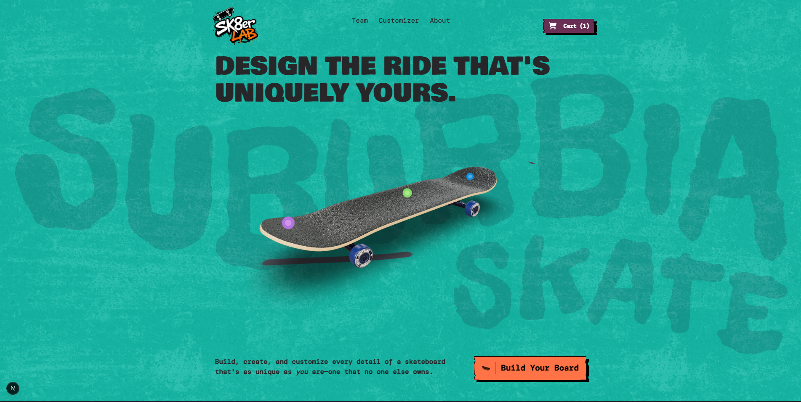
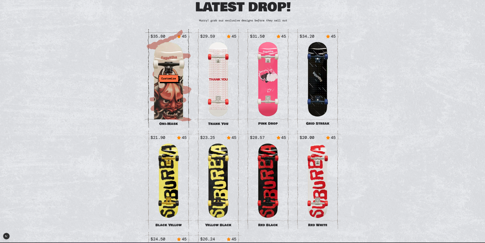
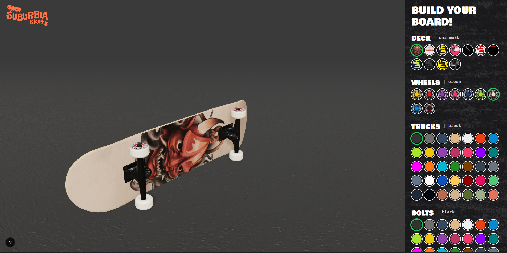

# Sk8erLab

A modern, high-impact Next.js experience for a skateboarding brand with interactive 3D visuals, cinematic motion, and Prismic-powered content.

## Project Preview







## Tech Stack

- Next.js 16
- React 19
- TypeScript
- Tailwind CSS 4
- Prismic CMS + Slice Machine
- GSAP for animation
- Three.js + React Three Fiber + Drei for 3D rendering
- Matter.js for physics-based interactions
- ESLint for linting

## Packages and Modules Used

### Core framework

- next
- react
- react-dom

### CMS and content

- @prismicio/client
- @prismicio/next
- @prismicio/react
- slice-machine-ui
- @slicemachine/adapter-next

### Animation and interactivity

- gsap
- @gsap/react
- three
- @react-three/fiber
- @react-three/drei
- matter-js

### UI and styling

- tailwindcss
- @tailwindcss/postcss
- clsx
- react-icons

### Development tools

- typescript
- eslint
- eslint-config-next
- @types/react
- @types/react-dom
- @types/node

## Project Structure

```text
sk8erlab/
├── app/
│   ├── api/
│   │   ├── exit-preview/
│   │   │   └── route.ts
│   │   ├── preview/
│   │   │   └── route.ts
│   │   └── revalidate/
│   │       └── route.ts
│   ├── build/
│   │   ├── context.tsx
│   │   ├── Controls.tsx
│   │   ├── Loading.tsx
│   │   ├── page.tsx
│   │   └── Preview.tsx
│   ├── slice-simulator/
│   │   └── page.tsx
│   ├── globals.css
│   ├── layout.tsx
│   └── page.tsx
├── components/
│   ├── Bounded.tsx
│   ├── ButtonLink.tsx
│   ├── Footer.tsx
│   ├── FooterPhysics.tsx
│   ├── Header.tsx
│   ├── Heading.tsx
│   ├── Line.tsx
│   ├── Logo.tsx
│   ├── S8Logo.tsx
│   ├── Skateboard.tsx
│   ├── SlideIn.tsx
│   └── SVGFilters.tsx
├── customtypes/
│   ├── board_customizer/
│   │   └── index.json
│   ├── homepage/
│   │   └── index.json
│   ├── settings/
│   │   └── index.json
│   ├── skateboard/
│   │   └── index.json
│   └── skater/
│       └── index.json
├── preview/
│   ├── prev1.png
│   ├── prev2.png
│   └── prev3.png
├── public/
│   ├── concrete-normal.avif
│   └── skateboard/
│       └── metal-normal.avif
├── slices/
│   ├── Hero/
│   │   ├── Hotspot.tsx
│   │   ├── index.tsx
│   │   ├── InteractiveSkateboard.tsx
│   │   ├── mocks.json
│   │   ├── model.json
│   │   ├── TallLogo.tsx
│   │   ├── WavyPaths.tsx
│   │   └── WideLogo.tsx
│   ├── ProductGrid/
│   │   ├── index.tsx
│   │   ├── mocks.json
│   │   ├── model.json
│   │   ├── Scribble.tsx
│   │   └── SkateboardProduct.tsx
│   ├── TeamGrid/
│   │   ├── index.tsx
│   │   ├── mocks.json
│   │   ├── model.json
│   │   ├── Skaters.tsx
│   │   └── SkaterScribble.tsx
│   ├── TextAndImage/
│   │   ├── index.tsx
│   │   ├── mocks.json
│   │   ├── model.json
│   │   └── ParallaxImage.tsx
│   ├── VideoBlock/
│   │   ├── index.tsx
│   │   ├── mocks.json
│   │   ├── model.json
│   │   └── LazyYTPlayer.tsx
│   └── index.ts
├── package.json
├── prismic.config.json
├── slicemachine.config.json
├── tsconfig.json
└── next.config.ts
```

## Prerequisites

Before you begin, make sure you have:

- Node.js 20+ installed
- npm, pnpm, or bun available
- A Prismic account if you want to connect the CMS to your own repository

## Step-by-Step Setup from Scratch

### 1. Clone the repository

```bash
git clone <your-repository-url>
cd sk8erlab
```

### 2. Install dependencies

```bash
npm install
```

### 3. Run the development server

```bash
npm run dev
```

Open http://localhost:3000 in your browser.

### 4. Configure Prismic content (optional but recommended)

This project is already wired for Prismic. To use your own content repository:

1. Create a Prismic repository.
2. Update the repository name in [prismic.config.json](prismic.config.json).
3. If needed, update the Slice Machine config in [slicemachine.config.json](slicemachine.config.json).
4. Start Slice Machine:

```bash
npm run slicemachine
```

### 5. Build for production

```bash
npm run build
npm run start
```

## Available Scripts

```bash
npm run dev       # start local development server
npm run build     # create a production build
npm run start     # start the production build
npm run lint      # run ESLint checks
npm run slicemachine  # launch Slice Machine
```

## How the Project Works

- The main app shell and routing live in the [app](app) directory.
- Reusable UI components are stored in [components](components).
- CMS-driven sections and page slices are defined in [slices](slices).
- Static assets and media are located in [public](public).
- Preview screenshots are stored in [preview](preview).

## Notes

If you want to customize the project further, the best places to start are:

- [app/page.tsx](app/page.tsx)
- [components](components)
- [slices](slices)
- [prismic.config.json](prismic.config.json)
